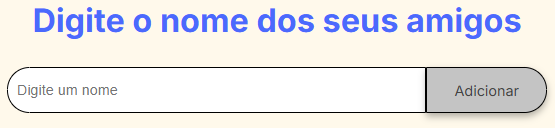
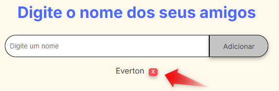
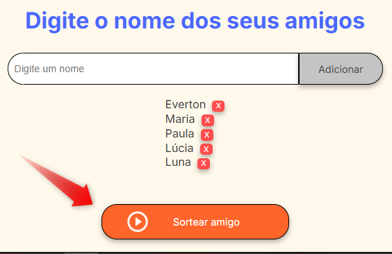

# Amigo Secreto 🎁

Bem-vindo ao projeto **Amigo Secreto**! Este aplicativo web permite que você organize um sorteio de amigo secreto de forma simples e interativa. Adicione os nomes dos participantes, realize o sorteio e divirta-se!

Interface do Amigo Secreto


---
## 📝 Funcionalidades

- **Adicionar Nomes**: Insira os nomes dos participantes no campo de entrada.
- **Remover Participantes**: Exclua participantes da lista com um clique.
- **Sortear Amigo Secreto**: Realize o sorteio de forma aleatória com apenas um botão.
  
---

## 🚀 Tecnologias Utilizadas

- **HTML5**
- **CSS3**
- **JavaScript (ES6)**

---

## 🛠️ Como Usar

1. Clone este repositório:
   ```bash
   git clone https://github.com/everton754/challenge-amigo-secreto_pt.git
   ```
2. Navegue até a pasta do projeto:
   ```bash
   cd amigo-secreto
   ```
3. Abra o arquivo `index.html` no navegador.

---

## 🎯 Passo a Passo

### 1. Adicionar Participantes
- Digite o nome do participante no campo "Digite o nome".
- Clique em "Adicionar" para incluir o nome na lista.
  
  

### 2. Remover Participantes
- Clique no botão "X" ao lado do nome na lista para removê-lo.
 

### 3. Realizar Sorteio
- Após adicionar todos os participantes, clique no botão laranja "Sortear amigo".
  
- O nome sorteado será exibido na tela.
---

## 📂 Estrutura do Projeto

```
amigo-secreto/
├── assets/
├── index.html      # Estrutura HTML do projeto
├── style.css       # Estilos visuais (CSS)
├── app.js          # Lógica do aplicativo (JavaScript)
└── README.md       # Documentação do projeto
```

---

## 📋 Requisitos

- Navegador moderno (Google Chrome, Firefox, Edge, etc.).
- Conexão com a internet para fontes externas (opcional).

---
## Status do Projeto ⭐

Projeto concluído ✅

---

## 💡 Melhorias Futuras

- Permitir salvar a lista de participantes localmente.
- Compartilhar os resultados por meio de links ou QR codes.
- Adicionar suporte a temas personalizados. Projeto concluído

---

## 🖋️ Autor

Desenvolvido por [Everton Santos](https://github.com/everton754). Sinta-se à vontade para contribuir ou entrar em contato!

---


